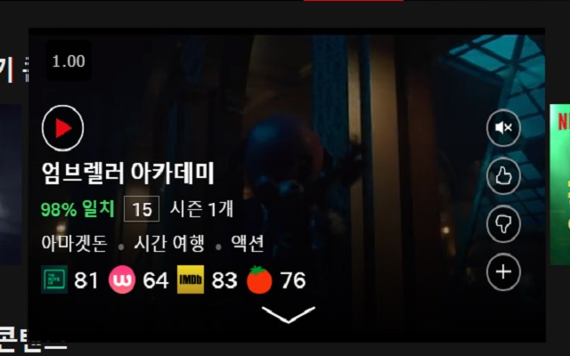

## Media Score

-   Show user score on the media list in ott service (browser extension)
-   When click score text, open info page in new tab
-   This is a simple search, may not be accurate.
-   Working site
    -   Netflix
    -   Play.Watcha
-   User score found at:
    -   Watcha
    -   Tmdb
    -   Imdb
    -   RottenTomatoes
-   
Icons made by <a href="https://www.flaticon.com/authors/freepik" title="Freepik">Freepik</a> from <a href="https://www.flaticon.com/" 		    title="Flaticon">www.flaticon.com</a> is licensed by <a href="http://creativecommons.org/licenses/by/3.0/" 		    title="Creative Commons BY 3.0" target="_blank">CC 3.0 BY</a></div
-   Use lit-element(webcomponents)

## Todo

-   [ ] Add Option page

## Build

-   `npm install`
-   build & pakaging `npm run build`
-   build `npm run build:dev`
-   watch `npm run watch:chrome`

## Watch Firefox

-   `npm run watch:firefox`
-   Open `about:debugging#addons`.
-   Load Temporary Add-on.
-   Work.
